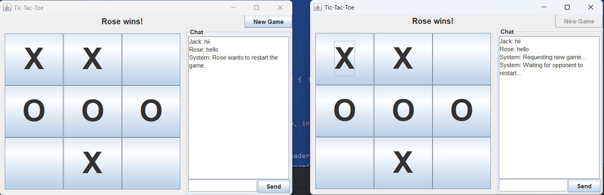
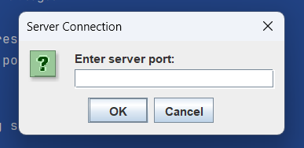
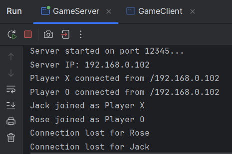

# 🌐 Online Multiplayer Tic-Tac-Toe Game with Chat feature

A feature-rich, online multiplayer Tic-Tac-Toe game built using Java and Swing, enabling two players to compete over a network connection. Includes a built-in real-time chat system for interactive gameplay.

---

## 🗂️ Project Structure

- `GameGUI.java` – Client-side graphical interface with Tic-Tac-Toe board and chat box.
- `GameClient.java` – Connects to the game server, manages network communication and UI interaction.
- `GameServer.java` – Central server that handles incoming client connections and game orchestration.
- `PlayerHandler.java` – A dedicated thread for each connected client; manages moves, messages, and state synchronization.

---

## 🎮 Features

✅ Online multiplayer gameplay over LAN or internet  
✅ Real-time chat between players  
✅ Java Swing GUI with responsive design  
✅ Turn-based logic with win/draw detection  
✅ Server handles multiple client sessions  
✅ Clean and readable modular code

---

## 🚀 How to Run the Game

### 🔧 Prerequisites
- Java JDK 8 or above
- Internet or LAN access for both players

---
### 🖥️ Step-by-Step Instructions

#### 🔹 1. Compile All Files

```bash
javac GameGUI.java   GameClient.java   GameServer.java   GameHandler.java
```
🔹 2. Run the Server (on host machine)
```bash
java GameServer
```
This will start the game server on default port (e.g. 12345). Ensure this port is open for external connections if playing over the internet.

🔹 3. Run the Clients (on both player machines)
```
java GameClient
```
Enter the host/server IP address

Wait for another player to join

✅ Game starts automatically once two players are connected.

💬 Chat Feature
Players can use the built-in chat box (embedded in the GUI) to message each other during the match in real time.

🌍 Multiplayer Setup Tips
If you're playing over LAN, use the internal IP address of the server.

If you're playing over the internet, the host may need to:

Use their public IP (e.g. from whatismyip.com)

Set up port forwarding on their router

Allow Java through firewall settings

## 📸 Screenshots

### 🎮 Game Board View


### 🌐 Client Connecting to Server


### 🌐 Serevr Connection


### 🏁 Connection Status


### 🛠️ Technologies Used Java

Java Swing (GUI)
Java Sockets (Networking)
Multithreading

## Structure
````
tic-tac-toe-java/
├── GameClient.java
├── GameGUI.java
├── GameServer.java
├── GameHandler.java
├── README.md
|__ images/
   ├── GameBoard.png
   ├── ServerIP.png
   ├── ServerPORT.png
   ├── GameStatus.png
